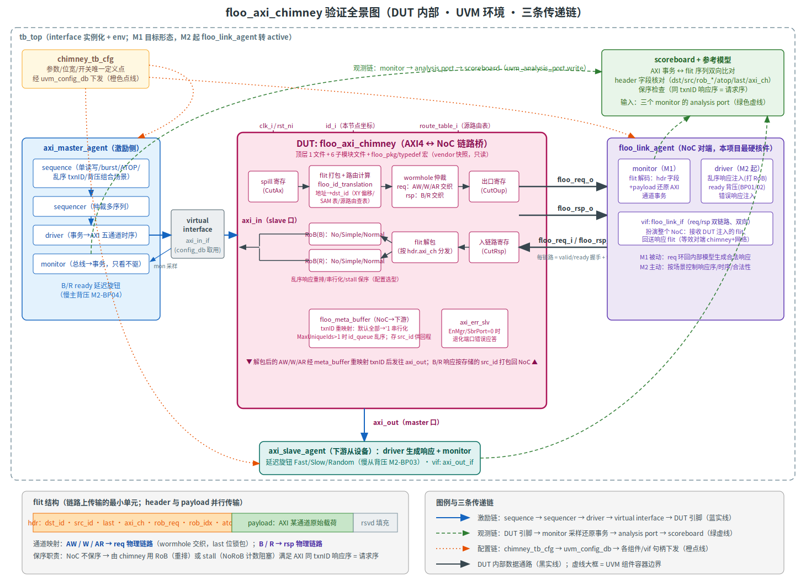

# floo_axi_chimney UVM 验证项目

对 [pulp-platform FlooNoC](https://github.com/pulp-platform/FlooNoC) v0.8.4 的 AXI4↔NoC 网络接口
`floo_axi_chimney` 进行独立 UVM 验证，目标六类覆盖率（line/cond/fsm/tgl/branch/assert）≥90%。



## 1. DUT 是什么

**一句话**：`floo_axi_chimney` 是 AXI4 总线与 FlooNoC 片上网络之间的桥（上游称 Network Interface / chimney）——
把 AXI 五通道事务打包成 flit 注入 NoC，反向解包，并替 NoC 补上 AXI 要求的保序语义。

**三大职责**：
1. **打包/解包**：AW/W/AR 打包走 req 物理链路（wormhole 交织），B/R 走 rsp 物理链路；flit = header（dst/src/last/axi_ch/rob_req/rob_idx/atop）+ payload + 填充位。
2. **保序**：NoC 链路层不保序，AXI 要求同 txnID 响应序=请求序。chimney 用 RoB 重排（NormalRoB/SimpleRoB）或 stall 阻塞（NoRoB）解决；出 NoC 方向还做 txnID 重映射（默认全部映射为 `'1` 串行化下游）。
3. **路由头生成**：请求地址 → 目的节点 ID（XY 坐标偏移 / SAM 地址映射表 / 源路由查表三种方式）。

**代码形态**：顶层单文件 + 实例树，全部在 `vendor/floonoc/hw/`：

| 文件 | 角色 |
| --- | --- |
| `floo_axi_chimney.sv` | 顶层（~880 行，打包/解包与控制骨架） |
| `floo_pkg.sv` | 类型/枚举/默认配置包 |
| `floo_id_translation.sv` | 地址→节点 ID 路由计算 |
| `floo_wormhole_arbiter.sv` | req/rsp 链路各一，通道交织仲裁 |
| `floo_rob_wrapper.sv` / `floo_rob.sv` / `floo_simple_rob.sv` | 重排序缓冲三种选型 |
| `floo_meta_buffer.sv` | txnID 重映射 + src_id 存储 |
| `include/floo_noc/typedef.svh` | flit/链路类型生成宏 |

**依赖与独立方式**：DUT 依赖三个 pulp 基础库（common_cells 的 spill_register/fifo/id_queue、axi 的 axi_pkg/err_slv、tech_cells_generic 的 tc_sram）。
本仓库用 **vendor 快照** 让它完全独立：5 个上游仓库按 Bender.lock 锁定版本拷入 `vendor/`（SHA 与本地补丁记录见 [vendor/VENDOR.md](vendor/VENDOR.md)），
编译顺序由 [sim/flist/](sim/flist/) 三个文件列表固化（依赖序抽取自各库 Bender.yml）——无需网络、无需 bender 工具，VCS 直接编译。
唯一一处 vendor 改动是补丁 P-001（VCS 2018 常量折叠缺陷的等价绕行，经审查 REV-001 复核）。

## 2. 验证环境（对照全景图）

### 2.1 组件职责

| 组件 | 职责 | 备注 |
| --- | --- | --- |
| `tb_top` | 实例化 DUT、三个 interface、时钟复位；`run_test()` 入口 | module 世界与 class 世界的边界 |
| `chimney_tb_cfg` | 参数/位宽/开关的**唯一定义点**，经 `uvm_config_db` 下发 | 禁止别处硬编码 |
| `env` | 容器：三 agent + scoreboard 的组装与连线 | |
| `axi_master_agent` | 激励主力：sequence 生成读写/burst/ATOP 事务，driver 转五通道时序打进 `axi_in` | B/R ready 延迟旋钮做慢主背压 |
| `axi_slave_agent` | 扮演下游从设备：对 `axi_out` 出来的请求生成响应 | Fast/Slow/Random 延迟做慢从背压 |
| `floo_link_agent` | **扮演整个 NoC**（最硬核件）：M1 被动监测+环回响应；M2 起主动注入乱序响应/背压/错误 | 打 RoB 覆盖的关键 |
| `scoreboard` | 三路 monitor 事务汇聚：AXI 事务↔flit 双向比对、header 字段核对、保序检查 | 期望值只准从 [doc/spec.md](doc/spec.md) 推导 |

### 2.2 三条传递链（图中三种线型）

1. **激励链（蓝实线）**：`sequence` 产生事务对象 → `sequencer` 仲裁 → `driver` 通过 **virtual interface** 把事务翻译成引脚级时序 → DUT 端口。
   virtual interface 是 class 世界访问 module 世界信号的唯一通道：`tb_top` 实例化 interface 并 `uvm_config_db#(virtual xxx_if)::set(...)`，driver/monitor 在 `build_phase` 里 `get` 到句柄。
2. **观测链（绿虚线）**：monitor 只看不驱，从 interface 采样还原成事务对象，经 `uvm_analysis_port.write()` 广播给 scoreboard。
3. **配置链（橙点线）**：`chimney_tb_cfg` 集中所有可变参数（DUT 参数镜像、agent 模式、延迟旋钮），经 `uvm_config_db` 下发到各组件。

## 3. 验证路线图

| 里程碑 | 交付 | 版本 |
| --- | --- | --- |
| M0 基建 ✅ | vendor 快照、脚本体系、VCS 排雷（P-001）、spec v0（REV-001 审查）、上游 tb 冒烟 | 0.0.x（tag v0.0.1） |
| M1 UVM 环境 | 三 agent + env + scoreboard v0，默认配置（NoRoB+XY）smoke PASS | 0.1.x |
| M2 功能覆盖 | floo_link_agent 转 active（乱序/背压/错误注入）、covergroup、SVA、ATOP、**背压五场景**、缺陷闭环启用 | 0.2.x |
| M3 多配置回归 | RoB 三模式 × MaxUniqueIds × ATOP 编译矩阵，`make regress` 全 PASS | 0.3.x |
| M4 覆盖率收敛 | 六类 ≥90%、源路由/IdTable 扩展、最终报告 | 0.4.x → **v1.0.0** |

**单个功能的微循环**（每个组件/场景都走一遍）：
[doc/testplan.md](doc/testplan.md) 登记场景 → 写代码 → `make lint` → `make run TEST=x SEED=n` → PASS 后 `make evidence` 机械登记证据 → rev 审查出书面记录。
角色分工：**核心 UVM 代码由人亲手写**；AI 主会话只做基础设施与空壳骨架；唯一 rev 子代理负责审查/仲裁/签核（详见 [CLAUDE.md](CLAUDE.md)）。

## 4. 背压测试规划（M2，实际场景刚需）

NoC 拥塞、慢从、慢主都会传导到 NI，这是 chimney 在真实 SoC 里的常态压力面。五个场景已登记 testplan：

| 场景 | 内容 | 检查点 |
| --- | --- | --- |
| M2-BP01 | floo req 链路对端 ready 随机/长周期拉低（NoC 拥塞） | flit 不丢不重、AXI 侧正确反压、valid 期间 flit 稳定 |
| M2-BP02 | floo rsp 链路背压 | 响应通路完整、不因 rsp 堵塞死锁 req |
| M2-BP03 | axi_out 慢从（AW/W/AR ready 延迟：Fast/Slow/Random） | meta_buffer 满时入口 stall 而非丢事务 |
| M2-BP04 | axi_in 慢主（B/R ready 延迟） | RoB/直通路径反压传导正确 |
| M2-BP05 | 极限组合：全接口背压 + outstanding 打满 MaxTxns | 无死锁、无丢包、撤压后吞吐恢复 |

实现载体全部复用 M1/M2 组件：axi_slave_agent 延迟旋钮 + active floo_link_agent 的 ready 控制 + scoreboard 完整性比对，无新增组件。

## 5. 环境与工具

- **仿真**：Synopsys VCS-MX O-2018.09 + Verdi 同版，UVM-1.2（EDA 环境变量已在 [sim/Makefile](sim/Makefile) 内兜底，make 即用）
- **调试**：Verdi 波形（`make run FSDB=1` + `make verdi`）；AI 侧另有 xverif 工具箱（xdebug 波形因果/xcov 覆盖率/xloc 日志定位）
- **命令速查**：

| 命令 | 作用 |
| --- | --- |
| `make handover` / `make next` | 接手项目：状态总览 / 机械推导下一步 |
| `make smoke` | 冒烟仿真 |
| `make run TEST=<t> SEED=<n> [FSDB=1] [COV=1]` | 单测 |
| `make regress [COV=1]` / `make cov` | 回归 / urg 覆盖率报告 |
| `make lint` | VCS lint（判定范围限 tb/） |
| `make evidence SCEN=<ID> TEST=<t> SEED=<n>` | 从仿真 log 机械生成证据并回填 testplan |
| `make bump` / `make docs-check` / `make docs-archive` | 版本推进 / 文档守卫 / 滚动归档 |

- **首次克隆后**：`git config core.hooksPath .githooks`（启用 pre-commit 文档守卫）

## 6. 知识勾选清单

**SystemVerilog**
- [ ] interface / modport / clocking block（TB-DUT 边界与竞态规避）
- [ ] packed struct / enum / typedef 与参数化（DUT 配置全是 struct 参数）
- [ ] 宏与代码生成（`FLOO_TYPEDEF_*` / `AXI_TYPEDEF_*` 宏族展开机制）
- [ ] 约束随机（constraint / randomize / dist）
- [ ] fork-join / mailbox / semaphore（并发激励与同步）

**UVM-1.2**
- [ ] factory 注册与 create（`uvm_component/object_utils`）
- [ ] phase 机制（build/connect/run 及 objection 结束控制）
- [ ] sequence-sequencer-driver 握手（`start_item/finish_item`、`get_next_item/item_done`）
- [ ] uvm_config_db（virtual interface 与配置对象下发）
- [ ] analysis port / TLM（monitor→scoreboard 事务广播）
- [ ] agent 三件套组织与 active/passive 切换

**AXI4 协议**
- [ ] 五通道独立握手（valid/ready 规则：valid 不得依赖 ready、置起后不得撤销）
- [ ] 事务保序规则（同 ID 序、不同 ID 乱序自由）与 outstanding
- [ ] burst 语义（INCR/WRAP、last、窄传输）
- [ ] 写通道关系（AW-W-B 配对、W 不得先于 AW 完成？——查协议确认交织规则）
- [ ] ATOP 原子事务（AXI5 扩展，本 DUT 支持）

**NoC 概念**
- [ ] flit / header / payload、链路 valid-ready 流控
- [ ] wormhole 路由与 last 位锁包
- [ ] 路由算法：XY 维序 / 源路由 / 表路由，死锁自由性
- [ ] NI 保序策略：RoB 重排 vs stall 阻塞，各自代价
- [ ] txnID 重映射（串行化 vs id_queue 多 ID）

**覆盖率与检查方法学**
- [ ] covergroup / coverpoint / cross 与采样时机
- [ ] SVA（property / assert / bind 挂接）
- [ ] 六类代码覆盖率含义与 urg 报告解读
- [ ] 覆盖率收敛方法（hole 分析→定向序列→豁免评审）

**上游文档阅读顺序**（均在 vendor/floonoc/docs/）：`chimneys.md` → `flits.md` → `route_algos.md` → `links.md`；再对照 [doc/spec.md](doc/spec.md)（本项目单一事实源）。

## 7. 快速开始

```bash
git config core.hooksPath .githooks   # 首次克隆后
make handover                          # 当前状态一览
make smoke                             # 冒烟仿真
```

工程纪律（角色、证据规则、缺陷闭环、单一事实源）见 [CLAUDE.md](CLAUDE.md)；DUT 行为规格见 [doc/spec.md](doc/spec.md)；场景与证据链见 [doc/testplan.md](doc/testplan.md)。
